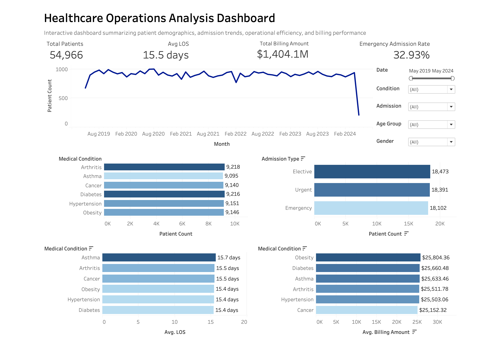

</> Markdown

# Healthcare Operations Analysis

## Project Overview

This project analyzes healthcare operations data to identify trends in patient admissions, length of stay, billing, and medical conditions. The project demonstrates an end-to-end data analytics workflow using Excel for data preparation, MySQL for analysis, and Tableau for interactive visualization.

---

## Objectives

- Clean and prepare healthcare data for analysis
- Analyze operational and financial performance using SQL
- Build an interactive dashboard to communicate key insights
- Demonstrate an end-to-end healthcare analytics workflow
  
---

## Tools Used
- Microsoft Excel
- MySQL
- Tableau
  
---

## Project Workflow

### 1. Excel - Data Cleaning

- Cleaning and standardized healthcare records
- Standardized date formats
- Created Age Group categories
- Calculated Length of Stay
- Validated data quality and consistency
  
### 2. MySQL - Data Analysis

Performed SQL analysis to answer key business questions, including:

- Total patient volume
- Average patient age
- Average length of stay
- Average billing amount
- Emergency admission percentage
- Admissions by medical condition
- Monthly admission trends
- Insurance provider analysis

### 3. Tableau - Dashboard

Developed an interactive dashboard featuring:

- Executive KPIs
- Patient distribution by medical condition
- Monthly admission trends
- Average length of stay
- Average billing by condition
- Interactive filters

---

## Dashboard Preview



---

## Repository Structure

```text
Healthcare-Operations-Analysis/
|
├── excel/
├── sql/
├── tableau/
├── data/
├── images/
├── LICENSE
└── README.md
```
---

## Key Skills Demonstrated 

- Data Cleaning
- SQL Query Development
- Data Validation
- KPI Reporting
- Data Visualization
- Dashboard Design
- Healthcare Operations Analysis

---

## Project Limitations

- The dataset is publicly available and was created for educational purposes rather than representing a real healthcare operation.
- Patient identifiers were anonymized, limiting patient-level, or longitudinal analysis.
- The analysis focused on descriptive insights and did not include predictive modeling or statistical inference.
- Business conclusions should be interpreted as exploratory rather than operational recommendations.

---

## Future Improvements

- Develop predictive models for patient length of stay or readmission risk.
- Incorporate additional operational metrics such as bed occupancy and resource utilization.
- Connect Tableau directly to a SQL database for automated dashboard updates.
- Expand the dashboard with drill-down functionality and additional KPIs.

---

## About

This project was created as part of my data analytics portfolio to demonstrate practical skills in Excel, SQL, and Tableau using a healthcare operations dataset.
